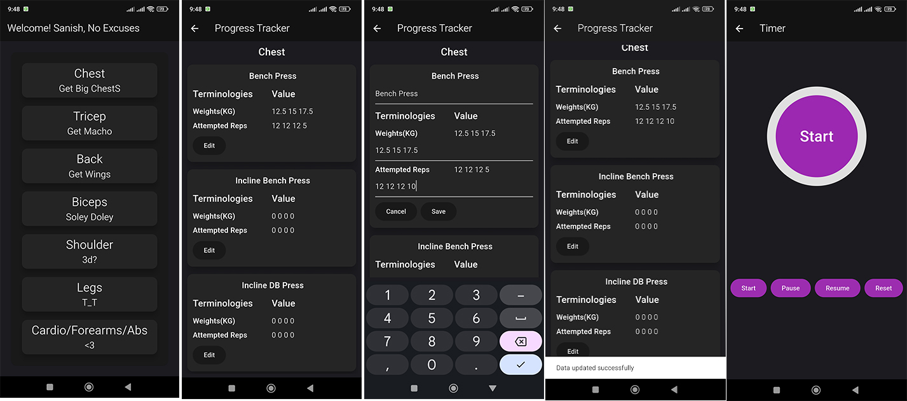

  <h1>Gym Tracker </h1> 
  
A flutter  application to Track My weights and reps progress in gym.

  

 

###Features

-  Edit Weights
-  Modify Reps
-  Timer for Cardio/Forearms/Abs Workouut

### Coding language
-Flutter framework  with dart (No state management used done using Stateful Widgets)

### Database/Storage
-SQLite plugin for flutter
  Local Storage done with the help of different  Databases and Tables

